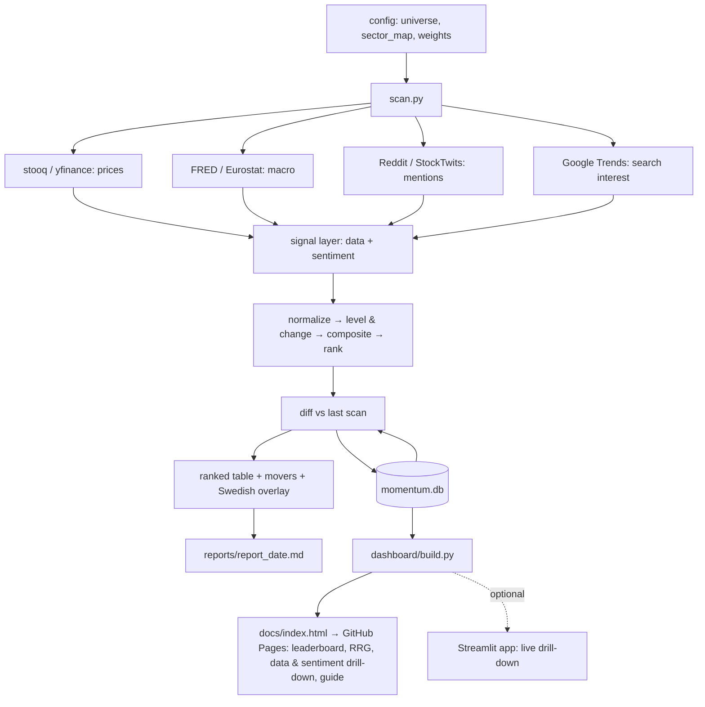

# Sector Momentum Scanner — Architecture Plan (v1)

**Goal:** A repeatable system that scans every ~2 days, scores and ranks market sectors against each other, compares the new scan to the previous one, and surfaces *early* momentum — sectors that are improving and climbing the rankings, not ones that have already run.

**Scope:** US + pan-European sectors as the signal layer, expressed into Swedish-listed names for trading. EU-wide sentiment via attention velocity. **Free data sources only.**

**Guiding principle:** "Early" = *change and acceleration*, not level. Every signal is judged on its rate of change, and the scan-to-scan delta is itself a first-class signal.

> This is analytical tooling for measuring momentum — not investment advice.

---

## 1. The scope reality (read this first)

Three design consequences fall out of "US + EU, mainly Swedish, EU-wide sentiment, free only":

1. **Sweden is too concentrated for sector rotation on its own.** Nasdaq Stockholm is dominated by industrials, financials, and tech/communications, and is nearly empty in energy and utilities. So we do *not* compute sector momentum from Swedish data. We compute it from US and pan-European sectors (clean, liquid, free daily data), then **translate** the leading sectors into Swedish tickers via a mapping table.

2. **Cross-market comparability needs a common taxonomy.** US SPDR sectors and European sector indices don't line up one-to-one. We map both into the **GICS 11** buckets so "US Tech" and "EU Tech" are directly rankable against each other.

3. **EU-wide sentiment polarity is the hard part on a free budget** (many languages, no cheap multilingual finance model). So v1 leans on **attention velocity** — mention counts and search interest, which are language-agnostic *and* lead better than polarity. Polarity scoring is deferred to a later phase.

---

## 2. Universe definition

### 2.1 US sectors — SPDR Select Sector ETFs

| GICS sector | ETF |
|---|---|
| Technology | XLK |
| Financials | XLF |
| Energy | XLE |
| Health Care | XLV |
| Industrials | XLI |
| Consumer Discretionary | XLY |
| Consumer Staples | XLP |
| Utilities | XLU |
| Materials | XLB |
| Real Estate | XLRE |
| Communication Services | XLC |

Benchmark: **SPY** (or **RSP** equal-weight, which makes relative strength less mega-cap-distorted — preferred).

### 2.2 European sectors — STOXX Europe 600 sector proxies

Use STOXX Europe 600 supersector indices (or the Amundi/iShares STOXX Europe 600 sector UCITS ETFs) and map them into the same GICS 11. Examples of the mapping:

- Technology → STOXX Europe 600 Technology
- Banks + Financial Services + Insurance → **Financials** (combine into one GICS bucket)
- Oil & Gas → Energy
- Health Care → Health Care
- Industrial Goods & Services → Industrials
- Retail + Travel & Leisure + Automobiles + Media (part) → Consumer Discretionary
- Food, Beverage & Tobacco + Personal Care → Consumer Staples
- Utilities → Utilities
- Basic Resources + Chemicals → Materials
- Real Estate → Real Estate
- Telecommunications + Media (part) → Communication Services

Benchmark: **STOXX Europe 600** total index.

> The exact STOXX → GICS mapping lives in a config file (`config/sector_map.yaml`) so it's auditable and editable, not buried in code.

### 2.3 Swedish expression layer (overlay, not a signal source)

- Market context: **OMXS30** and **OMXSPI** (broad).
- A maintained table `config/swedish_tickers.csv`: liquid Nasdaq Stockholm names → GICS sector → market cap. When a sector ranks high, the report lists the Swedish names sitting in it.

---

## 3. Data layer (free sources)

| Need | Primary (free) | Secondary / fallback | Notes |
|---|---|---|---|
| Daily price/volume (US + EU indices/ETFs) | **stooq** (no key, good EU coverage, daily) | **yfinance** | yfinance is unofficial and breaks; cache aggressively |
| US macro context | **FRED** API (free key) | — | rates, yield curve, USD |
| EU macro context | **ECB SDW** / **Eurostat** | — | rates, EUR; optional in v1 |
| Reddit attention | **Reddit API via PRAW** (free, OAuth, rate-limited) | Pushshift mirrors (unreliable) | mention counts/velocity |
| Search attention | **Google Trends via pytrends** (free, unofficial, flaky) | — | per-country EU interest |
| Nordic social investing | **Nordnet Shareville** (Nordic social platform) | Avanza/Placera forums | access constraints; v2+ |
| US social | **StockTwits** (self-tagged bull/bear) | — | US-centric; lower EU value |

### 3.1 Honest gaps in the free stack

These are normally strong signals but are hard to get reliably for free, especially for EU — they are **out of scope for v1** and flagged as paid upgrades:

- **ETF / fund flows** (real money moving into sectors — leading signal).
- **Earnings estimate revisions** (best fundamental early signal).
- **Constituent-level breadth** for EU sectors (heavy to assemble free).

A modest paid tier later (e.g., Tiingo / EOD Historical Data / Financial Modeling Prep) would close most of these. The architecture is built so they slot in as new signal modules without restructuring.

---

## 4. Signal layer

All signals are computed **per sector, per scan**, for both US and EU sectors. Grouped into two pillars.

### 4.1 Data pillar (the workhorse — weight ~70%)

| Signal | What it measures | Early-momentum role |
|---|---|---|
| **Relative strength** (sector ÷ benchmark) and its slope | trend in relative performance | core |
| **RS-Ratio + RS-Momentum** (RRG) | rotation quadrant: Leading / Weakening / Lagging / **Improving** | the "Improving" quadrant *is* early momentum |
| **Returns** 1M / 3M / 6M | multi-horizon momentum | weight the short horizons for "early" |
| **Acceleration** (Δ of 1M vs 3M momentum) | second derivative | separates early from mature |
| **Price vs 50/200-DMA + MA slope** | trend structure | confirmation |
| **Breadth proxy** | ETF vs its own MAs; constituent % >50DMA where free | confirms breadth of move |
| **Volume / OBV trend** | participation | confirmation |

> **Breadth honesty:** true constituent breadth (% of sector stocks above their 50-DMA) is expensive to assemble free, especially for EU. v1 proxies breadth with the sector ETF's own price-vs-MA structure plus, optionally, a handful of large constituents. Real constituent breadth is a v3/paid upgrade.

### 4.2 Sentiment pillar (attention overlay — weight ~30%)

| Signal | Source | Notes |
|---|---|---|
| **Mention velocity z-score** | Reddit (EU/Nordic + US subs), StockTwits | rate of change vs each ticker's own baseline — the real early tell |
| **Search-interest momentum** | Google Trends per EU country | language-agnostic, free |
| **Bull/bear ratio + its change** | StockTwits (self-tagged) | v1 polarity, mostly US |
| **(v3) Multilingual polarity** | FinBERT (EN) + multilingual model / translate-then-classify | deferred — the hard free problem |

Reddit/Nordic subs to track: `r/aktier` (Swedish), `r/Finanzen` (German), `r/vosfinances` (French), `r/eupersonalfinance`, `r/EuropeFIRE`, `r/stocks`, `r/investing`, `r/wallstreetbets` (US spillover).

**Sentiment is ticker-level → aggregate to sector** via the same GICS map, weighting by mention volume. Treat it as a *confirming/contrarian* overlay, never a standalone driver — it's noisy, gameable, and retail-biased.

---

## 5. Scoring & ranking

### 5.1 Normalize cross-sectionally

Within each scan, convert every raw signal to a **z-score (or percentile) across all sectors** so they're comparable. (US and EU sectors are scored within their own region first, then placed on a common ranking via the GICS map.)

### 5.2 Two scores, not one

This is what makes it an *early* detector:

- **Level score** — how strong the sector is *right now* (RS level, returns, price-vs-MA).
- **Momentum/Change score** — how fast it's improving (RS-Momentum, acceleration, mention velocity, search momentum, **and the scan-to-scan delta from §6**).

An **early candidate** = *low-to-mid Level* + *high Change* + *rising rank* + *sentiment velocity confirming*. A late/crowded sector = high Level, flattening Change.

### 5.3 Composite

```
composite = 0.70 * data_pillar + 0.30 * sentiment_pillar
```

Equal-weight within each pillar to start. **Resist over-tuning the weights** — that's where these systems overfit. Lock weights in `config/weights.yaml` and only change them after a backtest justifies it.

### 5.4 Persistence

Flag a sector as **"emerging"** only when its Change score and rank improve across **2–3 consecutive scans**, to filter one-off blips from real rotation.

---

## 6. State & comparison layer

### 6.1 Storage — SQLite

A single `momentum.db` file (free, zero-config, perfect for "compare to last scan"). One row per (scan_date, region, sector) with all raw signals, normalized scores, composite, and rank.

```
scans(scan_id, run_at, config_hash)
signals(scan_id, region, gics_sector, signal_name, raw_value, z_value)
scores(scan_id, region, gics_sector,
       level_score, change_score,
       data_score, sentiment_score,     -- pillar sub-scores stored separately
       composite, rank)
```

> **Store the pillars, not just the composite.** `data_score` and `sentiment_score` are persisted alongside the composite so the dashboard (§11) can chart the data and the sentiment on their own, and so divergence between them is queryable. The per-signal `signals` rows (including RRG `rs_ratio` / `rs_momentum` and mention-velocity z-scores) are what feed the drill-down and RRG views — keep them, don't collapse them into the composite.

### 6.2 Delta vs previous scan

On each run, join the new scan to the most recent prior scan and compute:

- `delta_composite` = new − prior
- `delta_rank` = prior_rank − new_rank (positive = climbing)
- `emerging_flag` (per §5.4 persistence)

History also enables **backtesting** later — don't trust any weighting until you've checked it would have flagged past rotations (e.g., energy 2021–22, regime shifts) *early*.

### 6.3 Output each run

1. **Ranked table** (all sectors, both regions, by composite).
2. **Movers report** (biggest `delta_rank` and `delta_composite`; the emerging-flag list).
3. **Swedish expression** — for top/emerging sectors, the matching Swedish tickers from §2.3.
4. A small `report_<date>.md` (or HTML) written to `reports/`.
5. **Dashboard refresh** — re-render the interactive dashboard (§11) from the updated DB; CI commits it so GitHub Pages serves the latest scan.

---

## 7. Orchestration & repeatability

**Scheduler: GitHub Actions cron (free).** It runs the scan on a schedule, *and* commits the updated `momentum.db` + report back to the repo — so you get free storage, version history, and logs in one place. (Local `cron` / Windows Task Scheduler also work but don't give you the free history.)

```yaml
# .github/workflows/scan.yml (sketch)
on:
  schedule:
    - cron: "0 6 */2 * *"   # every 2 days, 06:00 UTC
  workflow_dispatch: {}        # manual trigger
```

A single entrypoint `scan.py` runs the whole pipeline: load config → pull data → compute signals → score & rank → diff vs last scan → write DB + report.

---

## 8. Repo structure

```
sector-momentum/
├── scan.py                  # entrypoint: full pipeline
├── config/
│   ├── universe.yaml        # US ETFs, EU sector indices, benchmarks
│   ├── sector_map.yaml      # STOXX→GICS, ticker→GICS mappings
│   ├── swedish_tickers.csv  # Swedish expression layer
│   └── weights.yaml         # pillar/signal weights (versioned)
├── src/
│   ├── data/                # stooq, yfinance, FRED, pytrends (symbol Trends) loaders
│   ├── signals/             # data-pillar + sentiment-pillar calculators
│   ├── scoring.py           # normalize, composite, rank, level vs change
│   ├── state.py             # SQLite read/write, delta-vs-last-scan
│   └── report.py            # ranked table, movers, Swedish overlay, md/html
├── dashboard/
│   ├── build.py             # render static dashboard from momentum.db → docs/
│   ├── app.py               # optional Streamlit app (live, reads momentum.db)
│   ├── templates/           # Jinja2 templates (layout + per-panel)
│   └── assets/              # css + plotly bundle
├── data/
│   └── momentum.db          # SQLite snapshots (committed by CI)
├── docs/                    # generated static dashboard (GitHub Pages root)
│   └── index.html
├── reports/                 # report_<date>.md
├── tests/
└── .github/workflows/scan.yml
```

---

## 9. Tech stack (all free)

`Python 3.11+`, `pandas`, `numpy`, `requests`, `pandas-datareader`/`stooq`, `yfinance`, `pytrends` (Google Trends), `PyYAML`, `sqlite3` (stdlib). Optional sentiment polarity in v3: `transformers` + FinBERT.

**Dashboard (§11), all free:** `plotly` (figures, incl. RRG scatter and time series) + `jinja2` (templating) for the static GitHub Pages build; `streamlit` for the optional live app. No paid hosting — GitHub Pages and Streamlit Community Cloud are both free.

---

## 10. Data flow



---

## 11. Dashboard & interactive guide (GUI)

The scan already computes far more than a single number — separate **level** and **change** scores, a **data pillar** and a **sentiment pillar**, per-signal z-scores, RRG coordinates, and scan-to-scan deltas. The dashboard's job is to make all of that *visible and explorable*: you can watch the data and the sentiment on their own — not just the blended composite — and see *why* a sector sits where it does.

### 11.1 Delivery — two free options, one data contract

Both read the same `momentum.db` (plus a small exported JSON), so they never drift apart.

- **Static dashboard → GitHub Pages (default).** A `dashboard/build.py` step renders a self-contained `docs/index.html` on each run; CI commits it and GitHub Pages serves it free at `you.github.io/sector-momentum`. This reuses the existing "commit results to the repo" pattern exactly: zero hosting, full version history of the dashboard itself, always showing the latest committed scan (which matches the every-2-days cadence). Charts are Plotly figures embedded as HTML; the data (11 × 2 sectors × N scans — tiny) is embedded as JSON, so the page is fully offline-capable.
- **Streamlit app (richer, interactive).** `dashboard/app.py` reads `momentum.db` directly for live filtering, sector drill-down, and history scrubbing. Run it locally, or deploy free on Streamlit Community Cloud.

**Recommendation:** build the static dashboard first (truly zero-infra, matches the batch cadence). Add Streamlit later only if you want live, click-through drill-down.

### 11.2 Watch the pillars, not just the composite

This is a first-class requirement, so both the storage and the UI reflect it:

- The pillar sub-scores are persisted, not only the composite (see §6.1): `data_score` and `sentiment_score` per (scan, region, sector), beside `level_score`, `change_score`, and `composite`.
- Every ranking view shows **composite, data, sentiment, level, and change side by side** — sort or color by any of them.
- A dedicated **Data ⇄ Sentiment scatter** (x = data score, y = sentiment score) makes agreement vs divergence obvious: sentiment far ahead of data = speculative/crowded; data ahead of sentiment = under-the-radar — often the most interesting "early" case.

### 11.3 Panels

| Panel | What it shows | Phase |
|---|---|---|
| **Leaderboard** | All sectors, both regions. Columns: rank / composite / **data** / **sentiment** / level / change / Δrank / Δcomposite / emerging. Sortable; movers and emerging rows highlighted. | 1 |
| **RRG rotation plot** | RS-Ratio (x) vs RS-Momentum (y) scatter with the four quadrants (Leading / Weakening / Lagging / **Improving**) and multi-scan **tails** tracing each sector's path. The Improving quadrant is the early-momentum zone. Pure data pillar. | 1 |
| **Sector drill-down** | Pick a sector → its **data sub-signals** (RS & slope, returns 1/3/6M, acceleration, MA structure, breadth proxy, volume) and its **sentiment sub-signals** (mention-velocity z, search momentum, bull/bear) as small-multiples, plus composite/level/change time series across scans. | 1 (data) → 2 (sentiment) |
| **Data ⇄ Sentiment scatter** | Agreement vs divergence between the two pillars (§11.2). | 2 |
| **Movers & Emerging** | Biggest Δrank / Δcomposite and the persistence-flagged emerging list (§5.4), with sparklines. | 1 |
| **Swedish expression** | For top/emerging sectors, the mapped Nasdaq Stockholm names (§2.3). | 1 (basic) → 3 (polished) |
| **History / time-machine** | Scrub past scans (the DB keeps every snapshot) to replay how a rotation built up. | 1 |

### 11.4 The interactive how-to guide

A guide built *into* the dashboard, so the tool teaches itself rather than relying on a separate README:

- A **Guide tab** covering the core idea (early = change + acceleration, not level), how to read each panel, what the RRG quadrants mean, how to read the Data ⇄ Sentiment scatter, and what the emerging flag requires (2–3 consecutive scans, §5.4).
- **Contextual ⓘ tooltips** on every chart — hover for "what this shows / how to read it / what to distrust."
- A dismissible **first-run guided tour** that steps through Leaderboard → RRG → drill-down → movers.
- The honesty caveats live *in the UI*, not just this doc: sentiment is noisy, gameable, and often lags (a confirmer, not a driver); Sweden is an expression layer only; free feeds are fragile; and **this is analytical tooling, not investment advice.**

### 11.5 Build & stack

Static: `jinja2` (templating) + `plotly` (figures → embedded HTML), written to `docs/`. Live: `streamlit` + `plotly`. CI gains a "render dashboard" step after the scan that rebuilds `docs/` and commits it. All free.

---

## 12. Phased build plan

The GUI is built *alongside* the engine, not after it — even the data-only Phase 1 is far more usable with a dashboard, and the dashboard grows as each pillar comes online.

**Phase 1 — Data-only ranking engine + first dashboard**
US SPDR + STOXX Europe 600 sectors → GICS map → data-pillar signals → level/change scores → SQLite snapshots → delta-vs-last-scan → ranked + movers report. Schedule on GitHub Actions.
*GUI:* ship the **static dashboard** (Leaderboard, RRG rotation plot, data-pillar drill-down, Movers/Emerging, History) and the built-in **how-to Guide** with contextual tooltips. *This alone is a usable, visual early-rotation scanner.*

**Phase 2 — Attention layer (+ sentiment in the dashboard)**
Add Reddit mention velocity (EU/Nordic + US subs) and Google Trends momentum, aggregated to sectors. Blend in at 30%. Add StockTwits bull/bear for US.
*GUI:* the dashboard gains the **sentiment-pillar panels** in the drill-down and the **Data ⇄ Sentiment scatter**, so you can watch sentiment and data independently and spot divergence.

**Phase 3 — Depth & validation (+ validation views)**
Swedish expression overlay polished; multilingual sentiment *polarity* (FinBERT + multilingual/translate); constituent breadth; **backtest** the weighting against past rotations before trusting it.
*GUI:* add **backtest charts** (would past rotations have flagged early?) and the polished Swedish overlay; optionally stand up the **Streamlit app** for live drill-down.

**Later / paid upgrades**
ETF fund flows, earnings estimate revisions, intraday data, a managed price API to retire yfinance fragility.

---

## 13. Reliability notes (don't skip)

- **Free price feeds are fragile.** stooq/yfinance break and rate-limit; cache every pull, fail soft, and log gaps. A managed API is the first paid upgrade worth making.
- **Sentiment is the weak signal.** Noisy, gameable, retail/large-cap-biased, and often *lags* price. Velocity leads better than polarity; keep its weight modest and use it to confirm, not to lead. The dashboard should make this visible (it's why the pillars are charted separately), not hide it inside the composite.
- **Multilingual EU polarity is genuinely hard for free** — that's why v1 uses attention velocity instead. Don't pretend you have clean pan-EU sentiment until Phase 3.
- **Sweden is an expression layer, not a signal.** Don't compute rotation from a market with missing sectors.
- **Backtest before you trust the weights.** Confirm the system would have caught a couple of known past rotations *early*, not after the move.
- **The dashboard shows the last committed scan, not live prices.** That's by design — it matches the every-2-days cadence — but make the scan timestamp prominent so it's never mistaken for real-time.
- This is analytical tooling, **not investment advice.**
